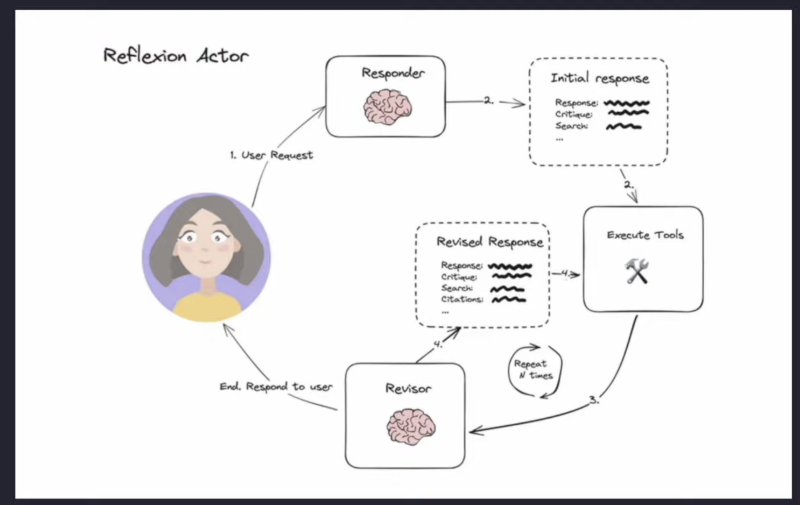

# LLM Agent Workflow using State Machine
```Langchain + LangGraph + LangSmith + Agents + Functions```

Built with LangGraph, LangChain, and LLM agents, this system demonstrates how structured autonomy can be achieved without relying entirely on human intervention.

---

## What This Project Is

Level 5 Autonomy where Decide output steps and which Steps to Take is decided by LLM itself for every Human Language NLP processing and LLMS Binds

```NLP +  LLM```


## Reflection vs Reflexion Agents

| Feature          | Reflection Agent                             | Reflexion Agent                              |
|------------------|----------------------------------------------|----------------------------------------------|
| How it learns    | Thinks about its own decisions               | Learns from past mistakes and tries again    |
| Feedback         | Uses self-review or prompts                  | Uses success/failure feedback                |
| Adaptability     | Somewhat flexible                            | Very flexible and improves over time         |
| Memory           | Optional or short-term                       | Keeps memory of what worked and what didn’t  |
| Goal             | Improve reasoning                            | Get better at solving tasks step by step     |
| Inspired by      | Human self-reflection                        | Trial-and-error learning like humans do      |
| Example          | [GraphVisulaization](GraphVisulaization) is a Reflection Agent. | [ReflexionAgent](ReflexionAgent) is a Reflexion Agent.|





## State and Message in LangGraph

1. State in LangGraph

    A state is the shared memory or data context that is passed between nodes in a graph.
        
            state = {
                "user_input": "Where is the Eiffel Tower?",
                "tool_results": {},
                "final_answer": None
            }

2. Message in LangGraph

    A message is a unit of information that is passed between nodes—often the data that triggers the next step in the graph.

        message = {
            "role": "user",
            "content": "Show me restaurants in Paris."
        }

        


