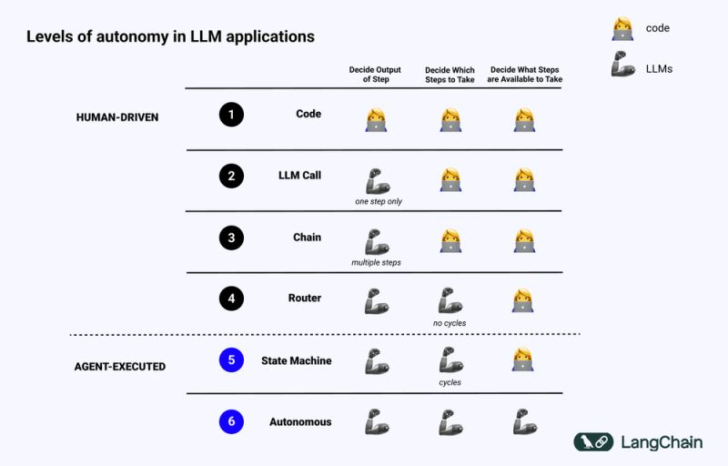

# LLM Agent Workflow using State Machine
```Langchain + LangGraph + LangSmith + Agents + Functions```

Built with LangGraph, LangChain, and LLM agents, this system demonstrates how structured autonomy can be achieved without relying entirely on human intervention.

---

## What This Project Is

Level 5 Autonomy where Decide output steps and which Steps to Take is decided by LLM itself for every Human Language NLP processing and LLMS Binds

```NLP +  LLM```


